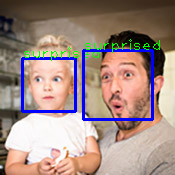
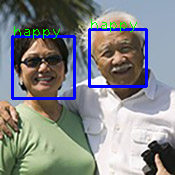
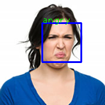
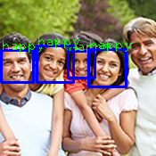
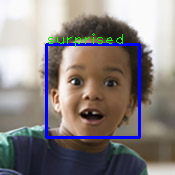
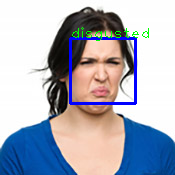

# Facial Expression Recognition

Facial expression recognition using convolutional neural network.

## Overview
### Requirement
- Python3.5
- opencv
- Keras
- tensorflow-gpu
- tflearn

### Data
[Kaggle_fer2013](https://www.kaggle.com/c/challenges-in-representation-learning-facial-expression-recognition-challenge/data):Include 35587 lableled images, you can download `fer2013.tar.gz` and decompress `fer2013.csv` in the `data` folder.

[RAF_Dataset](http://www.whdeng.cn/RAF/model1.html):Include 15399 basic images and 3954 compound images.

Some processed data can be found here: https://pan.baidu.com/s/14xwd8YeTFk_LDKVn0YSbQA PWD: xxm5

### Howtouse
- get data
- run ```python3 data_process.py``` to generate npy files for training
- run ```python3 train.py``` to train, you will get 3 'Gudi...' files after training
- copy 'Gudi_model_100_epochs_20000_faces.data-00000-of-00001' and rename it 'Gudi_model_100_epochs_20000_faces'
- run ```python3 predict_pic.py``` to predict faces of images
- run ```python3 predict_cam&pic.py``` to predict faces in camera or video

### Results
I find 5 images(happy,happy,suprised,disgusted,surprised) in [MS emotion_recognition API](https://azure.microsoft.com/zh-cn/services/cognitive-services/face/#recognition) and use them to test model.








The first row shows original images, the second shows predicted images using raf_aligned dataset, the third and fourth shows predicted images using Kaggle_fer dataset processed by opencv when scaleFactor=1.3&1.1 respectively.
It seems that the results using raf_aligned dataset are not good. The reason might be that raf_aligned images are processed by humans and we predict faces using opencv. So using raf dataset processed after processing by opencv to train the model might be better.
And the results seem better when using processed Kaggle_fer2013 dataset by scaleFactor=1.1. I think that is bacause of more training images.

## Reference
https://github.com/isseu/emotion-recognition-neural-networks

## Citation
    @inproceedings{li2017reliable,
      title={Reliable Crowdsourcing and Deep Locality-Preserving Learning for Expression Recognition in the Wild},
      author={Li, Shan and Deng, Weihong and Du, JunPing},
      booktitle={2017 IEEE Conference on Computer Vision and Pattern Recognition (CVPR)},
      pages={2584--2593},
      year={2017},
      organization={IEEE}
    }

